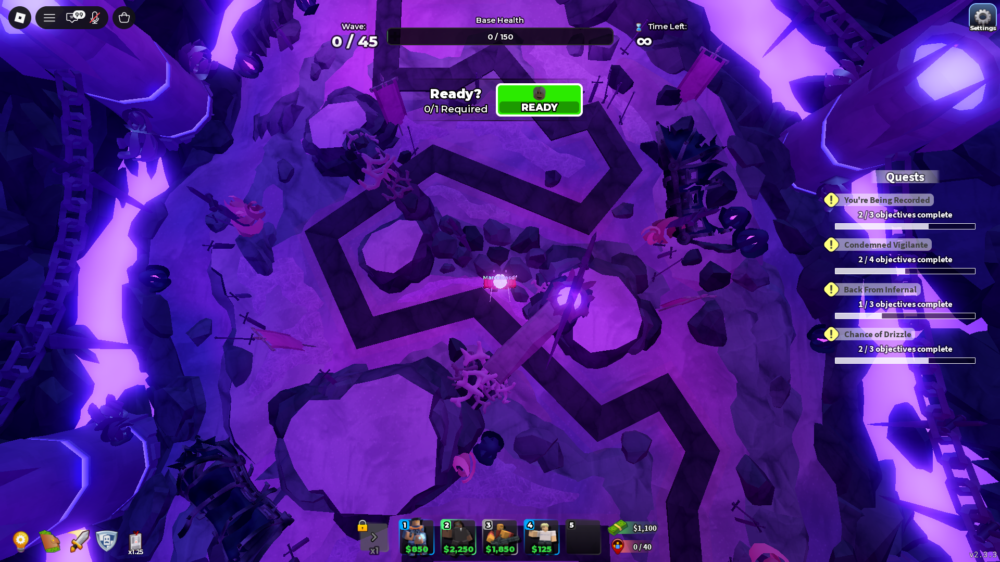

Macro de Farmeo de gemas TDS 
https://www.roblox.com/games/3260590327/Tower-Defense-Simulator

**Requisitos Previos:**

* Autohotkey v2
* Python 
* dependencias de Python instaladas mediante `"pip install opencv-python numpy mss"` 
* Resolución de Windows en 100% (no testeado con otras escalas)

**Controles y Atajos**

* F1: Iniciar el ciclo de grindeo automático.
* F2: Recargar el script (Reload).
* F3: Ajustar y calibrar la cámara al punto de partida.
* F7: Pausar / Reanudar el script.
* F8: Detener y cerrar el script por completo (ExitApp).

**Configuración y Funcionamiento**
* Modo y Mapa: Programado específicamente para Hardcore en el mapa Wretched Front.

* Calibracion de camara: antes de iniciarlo se debe hacer la calibración de cámara, aveces tiende a fallar asi que como referencia el personaje debe quedar mirando hacia donde vienen los enemigos / como en la foto

* Torres Requeridas: Golden Pyromancer y Crook boss en slots 1 y 2 respectivamente (deberia funcionar bien con pyro normal, no testeado) 
* Extras: dentro del codigo comentado se incluye la posibilidad de añadir otras torres (por ejemplo, para farmear XP), siempre que el dinero  alcance para completar el ciclo de mejora

